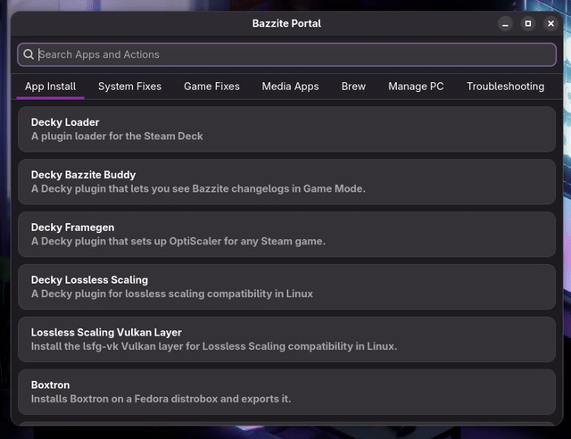

# Bazzite Portal

## Demo - KDE Plasma


## Demo - GNOME


A GTK4 interface for the Bazzite Portal, providing quick access to various useful scripts, fixes, and QOL tweaks for the terminal averse.

On installed systems, the default configuration file is located at:
```
/usr/share/yafti/yafti.yml
```

## Installing

On Fedora/Fedora based systems, install the [Terra repository](https://terra.fyralabs.com/).
Then, run the following command:

```
sudo dnf install bazzite-portal
```

## Running

The application requires a YAML configuration file path as a command-line argument.

One-shot actions open commands in your system's default terminal through `xdg-terminal-exec`.
Actions with options can define a modal with explicit buttons and a headless status check.

### On Bazzite (default config)

```bash
yafti_gtk.py /usr/share/yafti/yafti.yml
```

### With Custom Config

```bash
yafti_gtk.py /path/to/custom/yafti.yml
```

### Desktop Shortcut

The installed desktop file automatically launches with the default Bazzite config path. You can find it in your application menu as "Bazzite Portal".

## Configuration

The app reads a `yafti.yml` configuration file to populate tabs and actions.

One-shot actions launch directly in a terminal:

```yaml
screens:
  - title: "Category Name"
    actions:
      - title: "Action Title"
        description: "Optional description"
        script: "command to run"
```

Managed actions open a modal instead. The modal runs `status_script` headlessly, then shows the configured buttons:

```yaml
screens:
  - title: "Category Name"
    actions:
      - id: "sunshine"
        title: "Sunshine"
        description: "A self-hosted game stream host for Moonlight"
        status_script: |
          if systemctl is-enabled --user app-dev.lizardbyte.app.Sunshine.service >/dev/null 2>&1; then
            echo enable
          else
            echo disable
          fi
        options:
          - id: "enable"
            label: "Enable"
            script: "ujust setup-sunshine enable"
          - id: "disable"
            label: "Disable"
            script: "ujust setup-sunshine disable"
```

Rules:

- Actions with `options` or `status_script` use the modal flow.
- Actions with only `script` launch directly in a terminal.
- `status_script` should print a short stable status string such as `enable`, `disable`, or `install-beta`.
- Modal button highlighting matches the returned status string against the option `id`.
